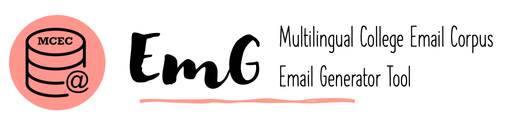
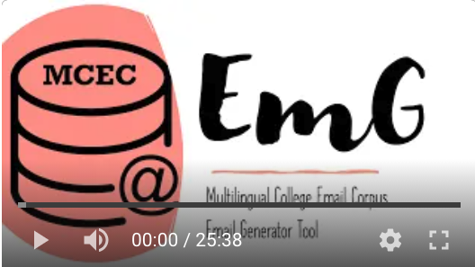

# MCEC-EmG | Multilingual College Email Corpus - Email Generator Tool

- [MCEC-EmG | Multilingual College Email Corpus - Email Generator Tool](#mcec-emg--multilingual-college-email-corpus---email-generator-tool)
  - [Overview](#overview)
  - [Project Organization](#project-organization)
  - [Getting Started](#getting-started)
    - [Requirements](#requirements)
    - [Installation Instructions](#installation-instructions)
      - [If you don't have a `conda` environment](#if-you-dont-have-a-conda-environment)
      - [If you have a `conda` environment](#if-you-have-a-conda-environment)
  - [Using the email generator](#using-the-email-generator)
    - [Run the program](#run-the-program)
    - [Login and running options](#login-and-running-options)
    - [Emailing participants](#emailing-participants)
    - [Exiting the program and saving your progress](#exiting-the-program-and-saving-your-progress)
  - [Contribute](#contribute)
  - [Changelog](#changelog)
  - [License](#license)
  - [Final Notes](#final-notes)

-------------------------

## Overview

Generates and keeps track of MCEC Project emails to participants.

For a video demo you can click on the link below:

[](https://youtu.be/qv2vVUeRZNw)

## Project Organization
    .
    ├── AUTHORS.md
    ├── LICENSE
    ├── images
    ├── config
    ├── data
    │   ├── external
    │   ├── interim
    │   ├── processed
    │   └── raw
    ├── docs
    ├── notebooks
    ├── reports
    │   └── figures
    └── email_generator
        ├── data
        ├── external
        ├── models
        ├── tools
        └── visualization

## Getting Started

Follow this instructions to install and run the email_generator module on your computer.

### Requirements

1. Python (3.7.6) and up
2. [`pyperclip`](https://pypi.org/project/pyperclip/) ([1.8.1](https://pypi.org/project/pyperclip/1.8.1/))

### Installation Instructions


#### If you don't have a [`conda` environment](https://realpython.com/effective-python-environment/)

- [Install a working version of Python (v3.7.6) or above.](https://realpython.com/installing-python/)
- Make sure that you know how [to run python "from the command line"](https://realpython.com/run-python-scripts/)
- Make sure that the `email_generator` software folder is not compressed (unzip it if necessary)
- Open the command prompt or terminal in your computer
- [Change directories](https://www.howtogeek.com/659411/how-to-change-directories-in-command-prompt-on-windows-10/#:~:text=If%20the%20folder%20you%20want,window%2C%20and%20then%20press%20Enter.&text=The%20directory%20you%20switched%20to%20will%20be%20reflected%20in%20the%20command%20line.) to the `email_generator` software folder
- Again, make sure that you can run python from the command line
- Type `python setup.py develop` and enter on your console

```bash
# On Windows
> cd \path\to\email_generator\folder
> python setup.py develop

# On MacOS
$ cd /path/to/email_generator/folder
$ (sudo) python setup.py develop
```

- You may need to run as administrator (`sudo` in MacOS, `runas` in windows)
- Now you can run the program

```bash
# If your Python command is just `python` do:
python run.py

# If your Python command is `python3` do:
python3 run.py
```
- Go to the next instructions below in ["Using the email generator"](#using-the-email-generator)

- Alternatively, you may want to get a conda environment from: https://www.anaconda.com/

#### If you have a [`conda` environment](https://realpython.com/effective-python-environment/)

- You probably know how [to run python "from the command line"](https://realpython.com/run-python-scripts/)
- Create a new conda environment named `mcec` with python=3.7.6

```bash
# Create a new conda environment named mcec with python=3.7.6
conda create -n mcec python=3.7.6
```

- Activate your new environment

```bash
conda activate mcec
```

- Make sure that the `email_generator` software folder is not compressed (unzip it if necessary)
- Open the command prompt or terminal in your computer
- [Change directories](https://www.howtogeek.com/659411/how-to-change-directories-in-command-prompt-on-windows-10/#:~:text=If%20the%20folder%20you%20want,window%2C%20and%20then%20press%20Enter.&text=The%20directory%20you%20switched%20to%20will%20be%20reflected%20in%20the%20command%20line.) to the `email_generator` software folder
- Type `python setup.py develop` and enter on your console

```bash
# On Windows
(mcec) > cd \path\to\email_generator\folder
(mcec) > python setup.py develop

# On MacOS
(mcec) $ cd /path/to/email_generator/folder
(mcec) $ (sudo) python setup.py develop
```

- You can check your installation by running `conda list mceceg`

## Using the email generator

When you run the email_generator program from the command line, the program
will guide you through all the steps you need to email participants, add notes
and save your progress.

The program will prompt you for your `UA NetID`. Only principal investigators
(PIs) are allowed to recruit and contact participants, so only PI functionality
is currently supported.

### Run the program

To run the program after installation - See: [Installation Instructions](#installation-instructions) after installation - See: [Installation Instructions](#installation-instructions)

- Open the command-line interface (bash or command prompt)
- From the command prompt change directories (`cd`) to the email_generator directory
```bash

# On Windows
> cd \path\to\email_generator\folder
> python setup.py develop

# On MacOS
$ cd /path/to/email_generator/folder
$ python setup.py develop
```

- Run the program by typing `python run.py`

```bash
# If your Python command is just `python` do:
python run.py

# If your Python command is `python3` do:
python3 run.py
```

- You will be able to exit the program at any time by typing `cancel` at any prompt however __your latest progress may not be saved if you exit the program this way__.

### Login and running options

- The program will ask you for your `UA NetID`. 
- Type your `UA NetID` directly on the screen when prompted:

```
>>> To begin, enter your NetID:
```

- Input the academic term you are working on. A list will be provided. Make sure to __type the term exactly as it is shown on the list__

```
>>> Which academic term are you working on? These are the possibilities --> Fall20
Type here:
Fall20
```

- The program will ask if you are recruiting. Because no other functionalities have been implemented so far, it doesn't matter if you type `yes` or `no`, the program will assume that you will be recruiting instructors.

```
>>> Are you recruiting? (yes/no)
```
- The program will ask if this is a test. If you want to run the program in `test mode` as to familiarize yourself with it, you will need to type `yes` and then `continue` on the next prompt:

```
>>> Is this a test? (yes/no)
yes

                    *** THIS IS A TEST ***
                     
***THE PROGRAM WILL ONLY CREATE THREE EMAILS AND NO PROGRESS WILL BE SAVED ***

       *** enter "cancel" to exit WITHOUT saving ***

>>> Type "continue" to confirm 
continue
```
- Now you are running the program on `test mode`. Don't worry, none of your progress or notes will be saved now. To exit the program you can type `cancel` at any prompt so that you can start the program again by running `python run.py`.

__Note that `test mode` will only run for three participants and then it will exit. Do not use `test mode` to recruit participants because then we will have no record of which participants were contacted and which were not.__

### Emailing participants

If you answered `no` to the `>>> Is this a test? (yes/no)` prompt, you have started the process of emailing participants. The program will create emails and copy them to your computer's clipboard (exactly like if you had wrote the email yourself and done `control + c`). Then, you will be able to __open your web browser manually and paste the email on your UArizona Catmail (using Control + v)__

- For each participant, follow the instructions on the screen. There are two possibilities:
1. You will be asked to email the current participant. Make sure to adapt the greeting on your email accordingly. For instance it would be better to use `Dr.` with a professor whom you are not familiar with, or their first name if it is a colleague or a friend whom you are recruiting. Please adapt the greeting of the email to the circumstances.

```
******************************************************
****** Emailing [Participant Name]
****** [Professor, Assistant Professsor, Instructor, etc]
******************************************************

>>> Please email [Participant Name] now. After you do, come back and
>>> Type (Y/y)es to continue or (E/e)xit to STOP the program and SAVE: 
```
2. Add notes for current participant. Notes can be anything you want.

```
>>> Would you like to add any notes for [Participant Name] before continuing?
>>> Type (Y/y)es to add notes and continue or (N/n)o to skip adding notes and continue:
```
- The program will continue until you exit it or until you run out of participants. 

### Exiting the program and saving your progress

- When emailing participants, your progress will be saved automatically after adding a note or after typing `yes` to this prompt:

```
>>> Please email [Participant Name] now. After you do, come back and
>>> Type (Y/y)es to continue or (E/e)xit to STOP the program and SAVE: 
```

- When emailing participants, at any prompt you can type `exit`. This will save your current progress and exit.
- You can quit the program at any point by typing `cancel`, but this will not save your latest progress (it will not know whom you emailed last).

__*Note: In all cases when progress is saved it will be automatically reloaded the next time that you start the program again.__

## Contribute

If you wish to contribute please contact Damian Romero directly and make sure you are familiar with `git flow`, `git` and `GitHub` software development.

For learning `git flow` you can consult Damian's notes here: https://github.com/damian-romero/gitflow_toy/

## Changelog

v0.1.0:
 * First internal release
 * Project structure using [Reproducible Science cookiecutter](https://github.com/mkrapp/cookiecutter-reproducible-science)
 * README.md #2, #4, #6
 * `images/` including `EmG-Logo.png`

## License

This project is licensed under the [MIT License](https://opensource.org/licenses/MIT) - see the [LICENSE](LICENSE) file for details.

## Final Notes

__*Progress is saved to a file called `pickled_instructors_<TERMyy>`. Please do not delete this file nor the folder where it is stored until we have aggregated this information to our safe archives.__

The project structure for this repository was generated using the [Reproducible Science cookiecutter boilerplate by Mario Krapp (2016)](https://github.com/mkrapp/cookiecutter-reproducible-science)

------------


